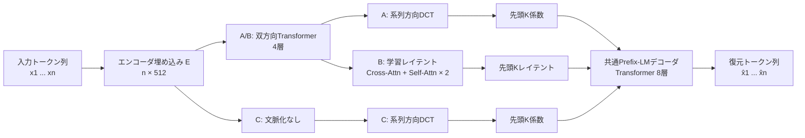

## エンコーダ・デコーダのアーキテクチャ

### 全体像

task3は、入力文を固定長以下の少数ベクトル `Z ∈ R^{K×512}` に圧縮する**エンコーダ側**と、`Z`を条件として元の文を自己回帰生成する**デコーダ側**に分かれる。



| 項目 | 設定 |
|---|---|
| 語彙数 | 16,384 |
| 入力長 | 32〜128トークン |
| 表現次元 | 512 |
| 最大圧縮ベクトル数 | `K_max = 64` |
| A/Bのエンコーダ | Pre-LN Transformer、4層、8ヘッド、FFN 2048、RoPE |
| Bのレイテント集約器 | 64クエリ、Cross-Attention → Self-Attention → FFNを2ブロック |
| 共通デコーダ | Pre-LN Transformer、8層、8ヘッド、FFN 2048、RoPE |

### エンコーダ側

#### 1. トークン埋め込み

入力ID列 `x ∈ {0,...,V-1}^n` を、学習可能な埋め込みテーブル`E`で512次元の系列へ変換する。

```text
x: [B, n]
  ↓ Encoder Embedding
H0: [B, n, 512]
```

このエンコーダ埋め込みと、後述するデコーダのトークン埋め込みは**別パラメータ**である。パディング位置はマスクされ、出力もゼロ化される。

#### 2. A/B共通の双方向Transformer

AとBでは、`H0`を4層の双方向Transformerで文脈化する。各層は次のPre-LN残差ブロックである。

```text
H' = H + MultiHeadSelfAttention(LayerNorm(H))
Hout = H' + FFN(LayerNorm(H'))
```

- Self-Attentionは8ヘッド、1ヘッドあたり64次元
- FFNは`512 → 2048 → 512`、活性化関数はGELU
- Q/KにRoPEを適用して系列位置を表現
- causal maskは使わず、各トークンが文全体を参照できる
- パディング位置はAttentionのkeyから除外

圧縮時には元の文全体を利用できるため、エンコーダは未来方向も見る**双方向**構成になっている。

#### 3-A. A: DCTボトルネック

文脈化系列`H ∈ R^{n×512}`に対し、各埋め込み次元を独立に系列方向へ直交DCT-II変換する。

```text
H: [B, n, 512]
  ↓ sequence-axis DCT-II
C: [B, n, 512]
  ↓ keep coefficients 0 ... K-1
Z: [B, K, 512]
```

係数インデックスが小さいほど低周波であり、先頭K個だけを残す。DCTは固定線形変換だが微分可能なので、損失の勾配はDCTを通って4層エンコーダと埋め込み`E`まで到達する。これにより、エンコーダには重要情報を低周波側へ集める学習圧力がかかる。

#### 3-B. B: 学習レイテントボトルネック

64個の学習可能クエリ`Q ∈ R^{64×512}`を用意し、エンコーダ出力から情報を集約する。各CrossBlockの内部は次の順序になっている。

```text
学習クエリ
  ↓ Cross-Attention（Q: レイテント、K/V: エンコーダ出力）
  + residual
  ↓ Latent Self-Attention
  + residual
  ↓ FFN（512 → 2048 → 512）
  + residual
```

これを2ブロック通して、`L ∈ R^{64×512}`を得る。DCTのような固定順序は与えず、学習時に先頭K個だけを残すprefix-dropによって、前方のレイテントほど重要になるよう学習させる。

```text
H: [B, n, 512]
  ↓ 64 learned queries + CrossBlock × 2
L: [B, 64, 512]
  ↓ keep latents 0 ... K-1
Z: [B, K, 512]
```

#### 3-C. C: 埋め込みのみ + DCT

Cは双方向Transformerを持たず、埋め込み列に直接DCTを適用する。

```text
入力ID → Encoder Embedding → DCT → 先頭K係数
```

AとCを比較することで、低周波集中や復元品質の改善が文脈化エンコーダによるものかを検証する。

### 共通デコーダ

デコーダはA/B/Cで共通の8層Transformer prefix-LMである。**逆DCTでトークン埋め込み列を復元するのではなく、圧縮ベクトル`Z`を条件prefixとして直接文章を生成する。**

#### 1. デコーダ入力の組み立て

各圧縮ベクトルを線形層`512 → 512`で射影し、係数またはレイテントの番号を表すindex embeddingを加える。さらに元の文長を表すlength embeddingを先頭に置く。

```text
[ LEN(n), Z1+IDX(1), ..., ZK+IDX(K), BOS, x1, x2, ..., xn ]
└────────────── 圧縮prefix ──────────────┘  └─ テキスト部 ─┘
```

- `LEN(n)`: 出力すべき元トークン数を伝える埋め込み
- `Zi`: DCT係数または学習レイテントを射影したベクトル
- `IDX(i)`: 圧縮ベクトルの順番を伝える埋め込み
- `BOS`: 生成開始を表す学習可能ベクトル
- `xi`: teacher forcingで与える正解トークンのデコーダ埋め込み

#### 2. Prefix-LMのAttention mask

Attentionの可視範囲は次のようになる。

| Query位置 | 参照できるKey位置 |
|---|---|
| `LEN`, `Z1...ZK` | 圧縮prefix全体を双方向に参照 |
| `BOS`, テキスト | 圧縮prefix全体 + 自分以前のテキスト |
| 全位置 | パディングされた係数・トークンは参照不可 |

したがって圧縮ベクトル同士は互いに情報交換できる一方、文章生成部分は通常の自己回帰モデルと同じく未来の正解トークンを見ることができない。

#### 3. Transformerブロックと出力

デコーダの各層もエンコーダと同じPre-LN型で、Self-AttentionとFFNからなる。

```text
入力系列
  ↓ [Pre-LN Self-Attention + residual
     Pre-LN FFN + residual] × 8
  ↓ Final LayerNorm
  ↓ Linear(512 → 16384)
各位置の次トークン確率
```

学習時は、`BOS`位置から`x1`、`x1`位置から`x2`というように次トークンを予測し、パディングを除いたcross-entropy lossを最小化する。生成時は圧縮prefixと`BOS`だけを最初に入力し、予測トークンを1個ずつ末尾へ追加するgreedy decodingを行う。生成を高速化するため、各層のKey/Value cacheを再利用する。

### A/B/Cの違いと共通部分

| 構成 | 文脈化 | 圧縮方法 | K個の順序を決めるもの | デコーダ |
|---|---|---|---|---|
| A: enc-dct | 4層双方向Transformer | DCT係数の先頭K個 | DCTの低周波→高周波順 | 共通8層prefix-LM |
| B: enc-latent | 4層双方向Transformer | 64学習レイテントの先頭K個 | prefix-dropによる学習 | 共通8層prefix-LM |
| C: emb-dct | なし | DCT係数の先頭K個 | DCTの低周波→高周波順 | 共通8層prefix-LM |

この比較により、A対Cで**文脈化の効果**を、A対Bで**固定DCT基底と学習可能ボトルネックの違い**を切り分ける。
